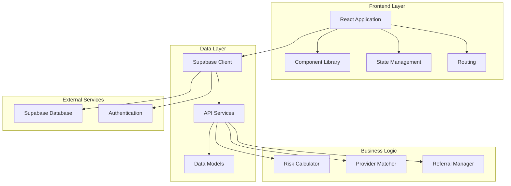

# Design Document

## Overview

The Healthcare Continuity MVP is a React-based web application that provides care coordinators with intelligent patient risk assessment and provider matching capabilities. The system leverages Supabase as the backend database and implements a modern, responsive UI using React, TypeScript, and Tailwind CSS with shadcn/ui components.

The application follows a component-based architecture with clear separation of concerns between data management, business logic, and presentation layers. The design prioritizes user experience through intuitive workflows, real-time data updates, and intelligent automation of complex matching algorithms.

## Architecture

### High-Level Architecture



### Technology Stack

- **Frontend Framework**: React 18 with TypeScript
- **Build Tool**: Vite
- **UI Framework**: Tailwind CSS with shadcn/ui components
- **Database**: Supabase (PostgreSQL)
- **State Management**: React Query (@tanstack/react-query)
- **Routing**: React Router DOM
- **Form Handling**: React Hook Form with Zod validation
- **Icons**: Lucide React
- **Deployment**: Vercel (Frontend), Supabase (Backend)

## Components and Interfaces

### Core Components

#### 1. Dashboard Component
- **Purpose**: Main landing page displaying prioritized patient list
- **Key Features**:
  - Patient list sorted by leakage risk score
  - Risk level visualization with color-coded badges
  - Referral status indicators
  - Quick navigation to patient details
- **Props**: None (fetches data internally)
- **State**: Patient list, loading states, error handling

#### 2. PatientDetailView Component
- **Purpose**: Detailed patient information and referral management
- **Key Features**:
  - Comprehensive patient summary
  - Risk factor breakdown
  - Provider matching interface
  - Referral status tracking
- **Props**: `patient: Patient`, `onBack: () => void`
- **State**: Selected provider, provider matching visibility, referral status

#### 3. ProviderMatchCards Component
- **Purpose**: AI-powered provider recommendation interface
- **Key Features**:
  - Top 3 provider recommendations
  - Intelligent ranking based on multiple criteria
  - Provider details and contact information
  - Selection and referral initiation
- **Props**: `patientInsurance: string`, `patientAddress: string`, `onProviderSelected: (provider) => void`, `onCancel: () => void`
- **State**: Provider list, selection state

### Data Models

#### Patient Interface
```typescript
interface Patient {
  id: string;
  name: string;
  dateOfBirth: Date;
  diagnosis: string;
  dischargeDate: Date;
  requiredFollowup: string;
  insurance: string;
  address: string;
  leakageRisk: {
    score: number;
    level: "low" | "medium" | "high";
    factors: RiskFactor[];
  };
  referralStatus: "needed" | "sent" | "scheduled" | "completed";
  createdAt: Date;
  updatedAt: Date;
}
```

#### Provider Interface
```typescript
interface Provider {
  id: string;
  name: string;
  type: string;
  specialties: string[];
  address: string;
  phone: string;
  email: string;
  acceptedInsurance: string[];
  rating: number;
  availability: ProviderAvailability;
  coordinates: {
    latitude: number;
    longitude: number;
  };
  createdAt: Date;
  updatedAt: Date;
}
```

#### Referral Interface
```typescript
interface Referral {
  id: string;
  patientId: string;
  providerId: string;
  serviceType: string;
  status: "pending" | "sent" | "scheduled" | "completed" | "cancelled";
  scheduledDate?: Date;
  notes?: string;
  createdAt: Date;
  updatedAt: Date;
}
```

### Database Schema

#### Patients Table
```sql
CREATE TABLE patients (
  id UUID PRIMARY KEY DEFAULT gen_random_uuid(),
  name VARCHAR(255) NOT NULL,
  date_of_birth DATE NOT NULL,
  diagnosis TEXT NOT NULL,
  discharge_date DATE NOT NULL,
  required_followup TEXT NOT NULL,
  insurance VARCHAR(255) NOT NULL,
  address TEXT NOT NULL,
  phone VARCHAR(20),
  email VARCHAR(255),
  created_at TIMESTAMP WITH TIME ZONE DEFAULT NOW(),
  updated_at TIMESTAMP WITH TIME ZONE DEFAULT NOW()
);
```

#### Providers Table
```sql
CREATE TABLE providers (
  id UUID PRIMARY KEY DEFAULT gen_random_uuid(),
  name VARCHAR(255) NOT NULL,
  type VARCHAR(100) NOT NULL,
  specialties TEXT[] NOT NULL,
  address TEXT NOT NULL,
  phone VARCHAR(20) NOT NULL,
  email VARCHAR(255),
  accepted_insurance TEXT[] NOT NULL,
  rating DECIMAL(2,1) DEFAULT 0.0,
  latitude DECIMAL(10,8),
  longitude DECIMAL(11,8),
  created_at TIMESTAMP WITH TIME ZONE DEFAULT NOW(),
  updated_at TIMESTAMP WITH TIME ZONE DEFAULT NOW()
);
```

#### Referrals Table
```sql
CREATE TABLE referrals (
  id UUID PRIMARY KEY DEFAULT gen_random_uuid(),
  patient_id UUID REFERENCES patients(id) ON DELETE CASCADE,
  provider_id UUID REFERENCES providers(id) ON DELETE CASCADE,
  service_type VARCHAR(255) NOT NULL,
  status VARCHAR(50) DEFAULT 'pending',
  scheduled_date TIMESTAMP WITH TIME ZONE,
  notes TEXT,
  created_at TIMESTAMP WITH TIME ZONE DEFAULT NOW(),
  updated_at TIMESTAMP WITH TIME ZONE DEFAULT NOW()
);
```

## Business Logic Algorithms

### Risk Score Calculation

The leakage risk algorithm evaluates multiple factors to determine patient risk:

```typescript
interface RiskFactors {
  ageRisk: number;        // Age-based risk (0-30 points)
  diagnosisRisk: number;  // Diagnosis complexity (0-25 points)
  distanceRisk: number;   // Geographic distance (0-20 points)
  insuranceRisk: number;  // Insurance limitations (0-15 points)
  timeRisk: number;       // Time since discharge (0-10 points)
}

function calculateLeakageRisk(patient: Patient): LeakageRisk {
  const factors = {
    ageRisk: calculateAgeRisk(patient.dateOfBirth),
    diagnosisRisk: calculateDiagnosisRisk(patient.diagnosis),
    distanceRisk: calculateDistanceRisk(patient.address),
    insuranceRisk: calculateInsuranceRisk(patient.insurance),
    timeRisk: calculateTimeRisk(patient.dischargeDate)
  };
  
  const totalScore = Object.values(factors).reduce((sum, score) => sum + score, 0);
  const level = totalScore >= 70 ? "high" : totalScore >= 40 ? "medium" : "low";
  
  return { score: totalScore, level, factors };
}
```

### Provider Matching Algorithm

The provider matching system ranks providers based on multiple weighted criteria:

```typescript
interface MatchingCriteria {
  specialtyMatch: number;    // Weight: 40%
  distanceScore: number;     // Weight: 25%
  insuranceMatch: number;    // Weight: 20%
  availabilityScore: number; // Weight: 10%
  ratingScore: number;       // Weight: 5%
}

function findTopProviders(patient: Patient, serviceType: string): Provider[] {
  const allProviders = getProvidersByType(serviceType);
  
  const scoredProviders = allProviders.map(provider => ({
    ...provider,
    matchScore: calculateMatchScore(patient, provider)
  }));
  
  return scoredProviders
    .sort((a, b) => b.matchScore - a.matchScore)
    .slice(0, 3);
}
```

## Error Handling

### Error Categories

1. **Network Errors**: Connection failures, timeouts
2. **Data Validation Errors**: Invalid input, missing required fields
3. **Business Logic Errors**: Risk calculation failures, matching algorithm errors
4. **Authentication Errors**: Session expiration, permission issues

### Error Handling Strategy

```typescript
interface ErrorState {
  type: 'network' | 'validation' | 'business' | 'auth';
  message: string;
  recoverable: boolean;
  retryAction?: () => void;
}

// Global error boundary for unhandled errors
class ErrorBoundary extends React.Component {
  // Implementation for catching and displaying errors
}

// Service-level error handling
async function handleApiCall<T>(apiCall: () => Promise<T>): Promise<T | null> {
  try {
    return await apiCall();
  } catch (error) {
    logError(error);
    showUserFriendlyError(error);
    return null;
  }
}
```

### User Experience for Errors

- **Loading States**: Skeleton components and progress indicators
- **Error Messages**: Clear, actionable error descriptions
- **Retry Mechanisms**: Automatic retry for transient failures
- **Fallback Content**: Alternative content when data fails to load
- **Offline Support**: Basic functionality when network is unavailable

## Testing Strategy

### Testing Pyramid

#### Unit Tests (70%)
- **Components**: Render testing, prop validation, user interactions
- **Business Logic**: Risk calculation, provider matching algorithms
- **Utilities**: Data transformation, validation functions
- **Tools**: Jest, React Testing Library

#### Integration Tests (20%)
- **API Integration**: Supabase client interactions
- **Component Integration**: Multi-component workflows
- **State Management**: Data flow between components
- **Tools**: Jest, MSW (Mock Service Worker)

#### End-to-End Tests (10%)
- **User Workflows**: Complete patient-to-referral journey
- **Cross-browser Testing**: Chrome, Firefox, Safari compatibility
- **Responsive Testing**: Mobile and desktop layouts
- **Tools**: Playwright or Cypress

### Test Data Strategy

- **Mock Data**: Realistic patient and provider datasets
- **Test Database**: Separate Supabase project for testing
- **Seed Scripts**: Automated test data generation
- **Data Cleanup**: Automated cleanup after test runs

### Performance Testing

- **Load Testing**: Concurrent user simulation
- **Database Performance**: Query optimization validation
- **Frontend Performance**: Bundle size, render performance
- **Accessibility Testing**: WCAG compliance validation

## Security Considerations

### Data Protection
- **Encryption**: All data encrypted in transit and at rest
- **Access Control**: Role-based permissions through Supabase RLS
- **Data Minimization**: Only collect necessary patient information
- **Audit Logging**: Track all data access and modifications

### Authentication & Authorization
- **Session Management**: Secure token handling
- **Role-Based Access**: Different permissions for different user types
- **Multi-Factor Authentication**: Optional 2FA for enhanced security

### Compliance
- **HIPAA Compliance**: Healthcare data protection requirements
- **Data Retention**: Automated data lifecycle management
- **Privacy Controls**: User consent and data deletion capabilities

## Performance Optimization

### Frontend Optimization
- **Code Splitting**: Lazy loading of components
- **Bundle Optimization**: Tree shaking, minification
- **Caching Strategy**: Browser caching, service worker implementation
- **Image Optimization**: Responsive images, lazy loading

### Database Optimization
- **Indexing Strategy**: Optimized queries for common operations
- **Connection Pooling**: Efficient database connection management
- **Query Optimization**: Minimize N+1 queries, use joins effectively
- **Caching Layer**: Redis for frequently accessed data

### Monitoring & Analytics
- **Performance Monitoring**: Real-time application performance tracking
- **Error Tracking**: Automated error reporting and alerting
- **User Analytics**: Usage patterns and feature adoption
- **Database Monitoring**: Query performance and resource utilization

## Code Quality Standards

### File Size Management
- **Maximum File Size**: Individual source files must not exceed 200-300 lines of code
- **Refactoring Trigger**: When a file approaches or exceeds this limit, it must be refactored into smaller, more focused modules
- **Refactoring Strategy**: 
  - Extract reusable functions into utility modules
  - Split large components into smaller, single-responsibility components
  - Separate business logic from presentation logic
  - Create custom hooks for complex state management
- **Benefits**: Improved maintainability, better testability, enhanced code readability, and easier code reviews