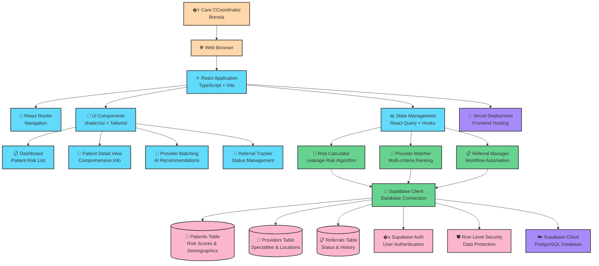

# Healthcare Continuity MVP - Architecture

## System Architecture Diagram

## Healthcare Continuity MVP Workflows

### Patient Risk Assessment Flow

1. **Dashboard Load**: Brenda opens the healthcare continuity dashboard
2. **Data Fetch**: React Query fetches all patients from Supabase patients table
3. **Risk Calculation**: Risk Calculator processes each patient's data using the leakage risk algorithm
4. **Risk Sorting**: Patients sorted by risk score (high to low) for priority focus
5. **Dashboard Display**: Color-coded patient list shows risk levels and referral status

### Provider Matching Flow

1. **Patient Selection**: Brenda clicks on a high-risk patient from the dashboard
2. **Patient Detail Load**: System fetches comprehensive patient information
3. **Provider Search**: Brenda initiates provider matching for required service type
4. **Multi-criteria Matching**: Provider Matcher algorithm evaluates:
   - Specialty alignment with patient needs
   - Geographic proximity to patient location
   - Insurance network compatibility
   - Provider availability and ratings
5. **Ranked Results**: Top 3 provider recommendations displayed with match explanations

### Referral Management Flow

1. **Provider Selection**: Brenda selects optimal provider from recommendations
2. **Referral Creation**: System creates referral record in referrals table
3. **Status Tracking**: Referral status updated from "needed" to "sent"
4. **Patient Update**: Patient record updated with referral information
5. **Dashboard Refresh**: Patient moves down priority list, status indicators updated

## Healthcare Continuity MVP Technology Stack

### Frontend Technologies

- **React 18**: Component-based UI with TypeScript for type safety
- **Vite**: Fast build tool and development server
- **Tailwind CSS**: Utility-first CSS framework for rapid styling
- **shadcn/ui**: High-quality, accessible component library
- **React Router**: Client-side routing for single-page application
- **React Query**: Data fetching, caching, and synchronization
- **React Hook Form**: Performant forms with easy validation
- **Lucide React**: Beautiful, customizable icons

### Backend & Database

- **Supabase**: Backend-as-a-Service providing:
  - PostgreSQL database with real-time subscriptions
  - Built-in authentication and authorization
  - Row Level Security (RLS) for data protection
  - Auto-generated APIs and TypeScript types
  - Real-time data synchronization

### Business Logic Algorithms

- **Risk Calculator**: Multi-factor algorithm considering:
  - Patient age and diagnosis complexity
  - Time since discharge
  - Geographic and insurance factors
  - Historical referral patterns
- **Provider Matcher**: Intelligent ranking system using:
  - Specialty matching algorithms
  - Geographic distance calculations
  - Insurance network verification
  - Availability and rating scoring

### Infrastructure & Deployment

- **Vercel**: Frontend hosting with automatic deployments
- **Supabase Cloud**: Managed PostgreSQL database hosting
- **GitHub**: Version control and CI/CD integration
- **TypeScript**: End-to-end type safety from database to UI

## Key Architectural Decisions for Healthcare Continuity MVP

### Why This Architecture?

#### Single-Page Application (SPA) Choice

- **Decision**: React SPA instead of multi-page application
- **Reasoning**: Care coordinators need fast, seamless navigation between patients
- **Benefits**: Instant page transitions, shared state management, better user experience

#### Supabase Backend-as-a-Service

- **Decision**: Supabase instead of custom backend
- **Reasoning**: Rapid MVP development with enterprise-grade features
- **Benefits**: Built-in authentication, real-time updates, automatic API generation, PostgreSQL reliability

#### Component-Based UI Architecture

- **Decision**: shadcn/ui + Tailwind CSS instead of custom styling
- **Reasoning**: Professional healthcare UI requires consistency and accessibility
- **Benefits**: Accessible components, consistent design system, rapid development

### Scalability Considerations

#### Database Design

- **Current**: Single PostgreSQL database with proper indexing
- **Future Scaling**:
  - Read replicas for reporting queries
  - Connection pooling for high concurrent users
  - Partitioning for large patient datasets

#### Frontend Performance

- **Current**: React Query for caching and optimistic updates
- **Future Scaling**:
  - Code splitting by feature modules
  - Service worker for offline functionality
  - CDN for static assets

#### Security & Compliance

- **Current**: Supabase Row Level Security (RLS) for data protection
- **Healthcare Requirements**:
  - HIPAA compliance through Supabase Business tier
  - Audit logging for all patient data access
  - Encryption at rest and in transit
  - Role-based access control for different user types

### Performance Optimization

#### Risk Calculation Efficiency

- **Algorithm Optimization**: Pre-calculated risk factors stored in database
- **Caching Strategy**: Risk scores cached and updated only when patient data changes
- **Batch Processing**: Multiple patient risk calculations processed efficiently

#### Provider Matching Speed

- **Geographic Indexing**: PostGIS extension for fast location-based queries
- **Insurance Lookup**: Normalized insurance data for quick matching
- **Result Caching**: Provider recommendations cached per patient/service type

#### Real-time Updates

- **Supabase Realtime**: Automatic UI updates when referral status changes
- **Optimistic Updates**: Immediate UI feedback before database confirmation
- **Background Sync**: Periodic data refresh to ensure accuracy

This architecture specifically addresses the needs of healthcare care coordinators like Brenda, focusing on speed, reliability, and ease of use for managing patient referrals and reducing healthcare network leakage.
